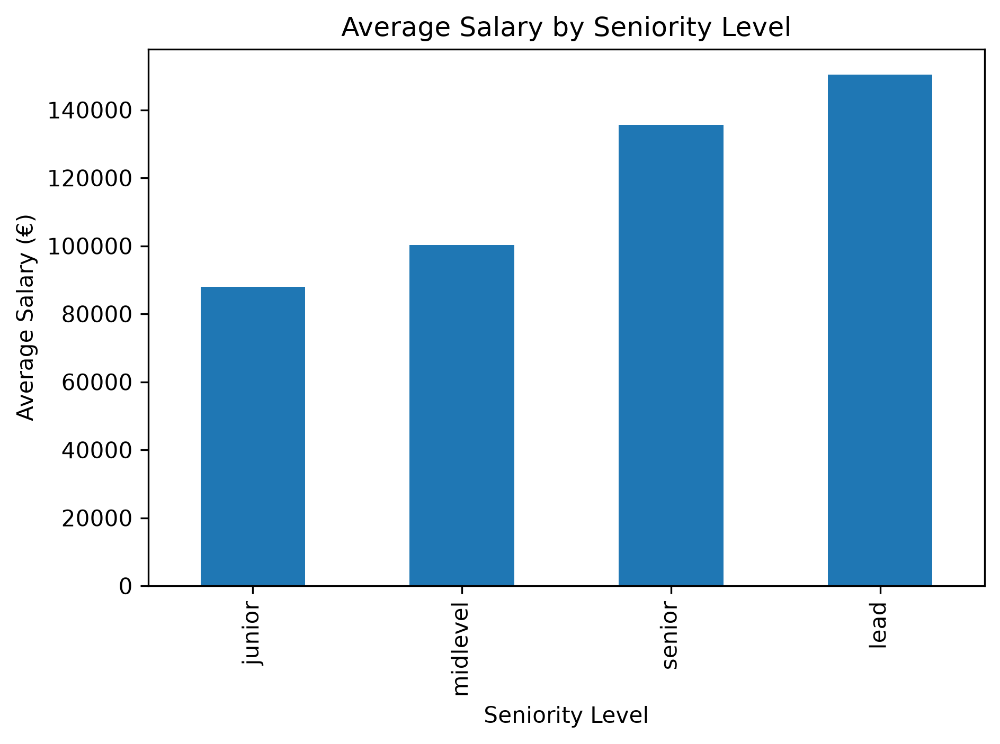
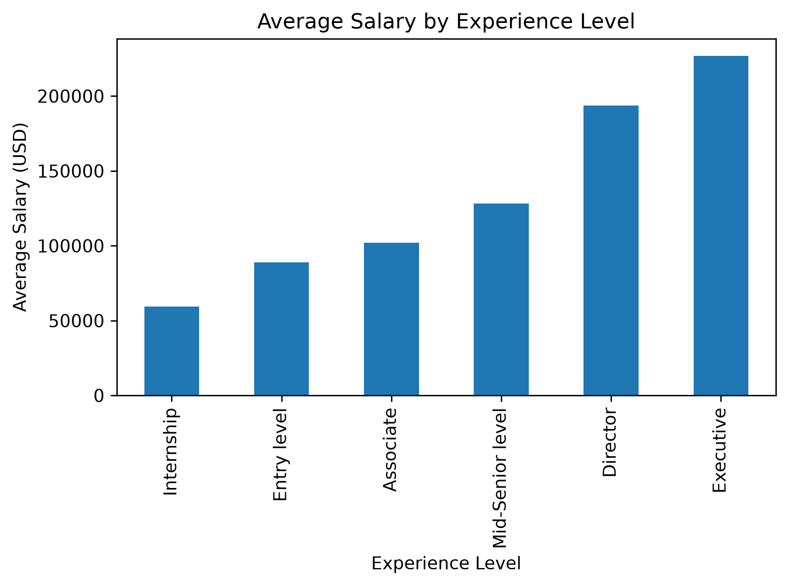
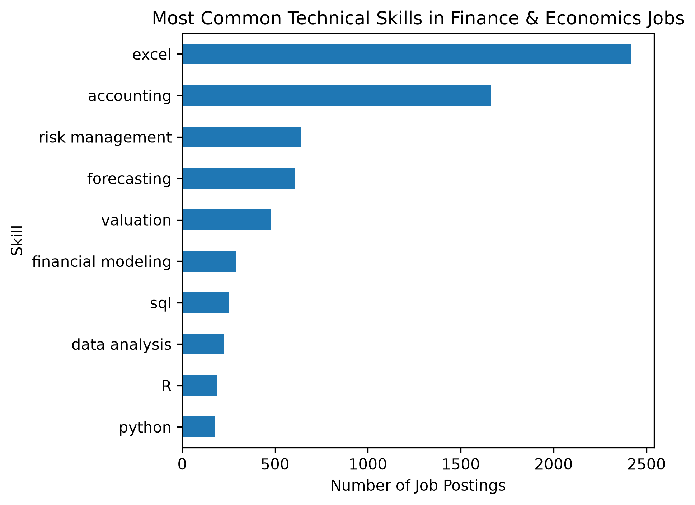

# Career Market Analytics

A data analytics project exploring labor market trends across Data Science and Finance/Economics careers.

## Project Overview

This project analyzes job posting data to identify:

- Salary trends
- Experience-level compensation differences
- In-demand technical skills
- Career progression patterns
- Cross-industry comparisons

The goal is to better understand how labor market demand differs across quantitative career paths.

---

## Technologies Used

- Python
- pandas
- NumPy
- Matplotlib
- Jupyter Notebook

---

## Project Structure

```text
data/
notebooks/
images/
```

---

## Analyses Included

### Data Science Job Market Analysis

Explores:

- Salary distribution
- Seniority-level compensation
- Skill demand
- Industry hiring trends

Notebook:

```text
notebooks/01_ds_job_market_analysis.ipynb
```

---

### Finance & Economics Job Market Analysis

Explores:

- Compensation by experience level
- Most requested skills
- Market demand trends

Notebook:

```text
notebooks/02_fin_econ_job_market_analysis.ipynb
```

---

## Visualizations

### Data Science Salaries by Seniority



### Finance Average Salary by Experience



### Finance Top Skills



---

## Key Findings

### Data Science

- Compensation generally increases with seniority
- Senior and executive roles command significantly higher salaries
- Entry-level roles provide accessible entry points into the field

### Finance & Economics

- Salary growth follows experience progression
- Quantitative and analytical skills remain highly demanded
- Technical tools increasingly appear in finance job postings

---

## Author

Lavin Ma

B.S. Mathematics–Computer Science  
University of California, San Diego

Incoming Master of Engineering (Data Science)  
University of California, Los Angeles